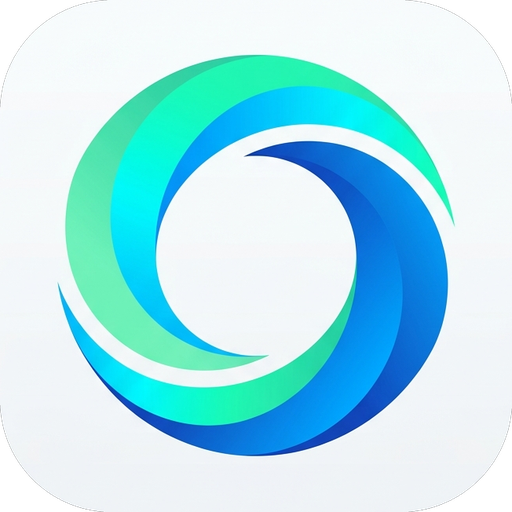
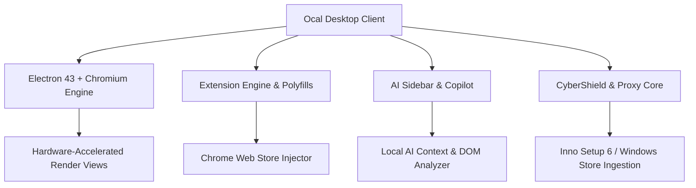

<div align="center">

  

  # 🌌 Ocal Browser
  ### **Fast • Private • Agentic • Modern**

  <p align="center">
    <b>A next-generation web browser engineered for the agentic intelligence era.</b><br>
    Combining fluid glassmorphic aesthetics, native Google Chrome extension support, and intelligent AI automation.
  </p>

  <p align="center">
    <a href="https://github.com/neelkanth-patel26/Ocal-Browser/releases/latest">
      
    </a>
    <a href="https://github.com/neelkanth-patel26/Ocal-Browser/releases/download/v9.1.05/Ocal-9.1.05-Setup.exe">
      
    </a>
    <a href="LICENSE">
      
    </a>
    <a href="https://github.com/neelkanth-patel26/Ocal-Browser/stargazers">
      
    </a>
  </p>

</div>

---

## ⚡ Highlights: v9.1.05 Stable

> [!TIP]
> **Production-Ready & Microsoft Store Testable**: v9.1.05 brings full compatibility for Windows 10 & 11 (including Snapdragon ARM64 via Prism emulation and native x64), complete Chrome Web Store 1-click extension installation, real-time color harmonizer, and refined system status indicators.

<div align="center">

| 🧩 Chrome Extensions Engine | 🤖 AI Copilot Sidebar | 🛡️ CyberShield Privacy | 📄 Native PDF Viewer |
| :---: | :---: | :---: | :---: |
| 1-Click Web Store installer with dynamic popup auto-sizing | Fluid sliding sidebar with smart page summaries | NCR regional lock defeat & canvas fingerprint defense | Dedicated emerald 2D document reader & tab manager |

</div>

---

## ✨ Flagship Features

### 🧩 Chrome Extensions Engine (Manifest V3 & V2)
- **1-Click Web Store Injector**: Browse `chromewebstore.google.com` and install any extension directly with custom progress indicators and real-time state sync.
- **Dynamic Popup Auto-Sizing**: Measures declared CSS rules and DOM bounds in real time to eliminate horizontal gaps and clipping.
- **Universal Shims**: Built-in runtime polyfills for `chrome.windows`, `chrome.storage.sync`, `chrome.action`, `chrome.tabs`, `chrome.runtime`, and `chrome.scripting`.
- **Preloaded Power Extensions**: Out-of-the-box support for **uBlock Origin**, **Return YouTube Dislike**, **Dark Reader**, and **AHA Music**.

### 🤖 Intelligent AI Copilot & Automation
- **Fluid Sidebar Architecture**: Ultra-smooth slide-in drawer with custom cubic-bezier easing.
- **Deep Webpage Understanding**: Real-time extraction of DOM metadata, article content, and structured headings for instant Q&A.
- **Quick Action Pills**: Streamlined prompt shortcuts for summarization, grammar refinement, and research.
- **Non-Intrusive Overlays**: Native glassmorphic modals replacing disruptive native OS dialogs.

### 🛡️ CyberShield & Stealth Privacy
- **Anti-Hijacking NCR Engine**: Intercepts regional queries and forces `google.com/ncr` (No Country Redirect) to prevent ISP/geo redirects.
- **Fingerprinting Shield**: Sanitizes Shadow DOM traces and shields against canvas & audio fingerprinting.
- **Silent Global Proxy Layer**: Multi-protocol PAC failover supporting high-anonymity SOCKS5/HTTPS nodes with native geolocation masking.

### 🎬 Portal Video PiP Engine
- **Direct-Link Media Extraction**: High-performance popout video player for YouTube, Twitch, Vimeo, and HTML5 streams.
- **Glassmorphic Circular HUD**: Floating controls with opacity toggles, always-on-top mode, and volume booster.
- **Zero-Lag Overlay**: Fluid frame-rate playback detached from page layout reflows.

### 🎨 2D Squircle Aesthetics & Color Harmonizer
- **Modern 2D Squircle Branding**: Clean, pixel-perfect app icon designed to match modern Windows 11 Fluent guidelines.
- **Color Harmonizer**: Automatically shifts browser accent colors, highlight glows, and widget badges to complement your active theme.
- **Shadowless Glassmorphism**: Crisp border lines and subtle backdrop blur with zero hover jitter.

---

## 💻 Tech Stack & Architecture

<div align="center">



</div>

| Layer | Technology | Purpose |
| :--- | :--- | :--- |
| **Framework** | **Electron 43** | Multi-process desktop application shell |
| **Runtime** | **Node.js + Chromium Engine** | Fast, secure web standards execution |
| **Interface** | **Vanilla CSS + Glassmorphic Design** | High-performance styling without heavy framework overhead |
| **Packaging** | **Inno Setup 6.7 + Electron Forge** | Silent user installation (`PrivilegesRequired=lowest`) & auto-updater |
| **Compatibility** | **Windows 10 / 11 (x64 & ARM64)** | Tested on Intel, AMD, and Qualcomm Snapdragon Surface devices |

---

## ⌨️ Quick Navigation & Shortcuts

| Shortcut | Action | Description |
| :--- | :--- | :--- |
| <kbd>Ctrl</kbd> + <kbd>T</kbd> | **New Tab** | Opens the customizable new tab showcase |
| <kbd>Ctrl</kbd> + <kbd>W</kbd> | **Close Tab** | Closes the current active tab |
| <kbd>Ctrl</kbd> + <kbd>Shift</kbd> + <kbd>A</kbd> | **Toggle AI Sidebar** | Opens/closes the floating AI copilot |
| <kbd>Ctrl</kbd> + <kbd>Shift</kbd> + <kbd>E</kbd> | **Extensions Hub** | Manage installed extensions and permissions |
| <kbd>Ctrl</kbd> + <kbd>L</kbd> / <kbd>Alt</kbd> + <kbd>D</kbd> | **Focus Address Bar** | Quick URL navigation and search |
| <kbd>Ctrl</kbd> + <kbd>H</kbd> | **History & Downloads** | View navigation history and active downloads |
| <kbd>F11</kbd> | **Fullscreen Mode** | Distraction-free immersive browsing |

---

## 📥 Installation

### Method 1: Official Windows Installer (Recommended)
1. Head to the **[Latest Releases](https://github.com/neelkanth-patel26/Ocal-Browser/releases/latest)**.
2. Download **`Ocal-9.1.05-Setup.exe`**.
3. Run the installer. Ocal installs silently to your local user directory without requiring Administrator / UAC elevation.

### Method 2: Silent / Unattended CLI Installation
For enterprise deployments, scripts, or Microsoft Store ingestion:
```powershell
# Silent installation
.\Ocal-9.1.05-Setup.exe /VERYSILENT /SUPPRESSMSGBOXES /NORESTART /SP-

# Silent uninstallation
"%LOCALAPPDATA%\Programs\Ocal\unins000.exe" /VERYSILENT /SUPPRESSMSGBOXES /NORESTART
```

---

## 🛠️ Building from Source

### Prerequisites
- **Node.js**: v18.0 or higher
- **npm**: v9.0 or higher
- **Inno Setup 6**: For compiling the Win32 installer (optional, for builds)

### Setup & Development
```bash
# Clone the repository
git clone https://github.com/neelkanth-patel26/Ocal-Browser.git

# Enter the project directory
cd Ocal-Browser

# Install project dependencies
npm install

# Start development instance
npm start
```

### Compiling Distributables
```bash
# Compile packed Electron application
npm run package

# Build the Inno Setup standalone installer (.exe)
npm run build-inno
```

---

## 📜 License & Acknowledgments

- **Author**: Gaming Network Studio Media Group
- **License**: Distributed under the **ISC License**. See [`LICENSE`](file:///c:/Project/Gaming%20Network/Software/Brower/LICENSE) for details.
- **Built for**: The global community of creators, power users, and developers.

<div align="center">
  <sub>Crafted with passion for speed, privacy, and the agentic future.</sub>
</div>
